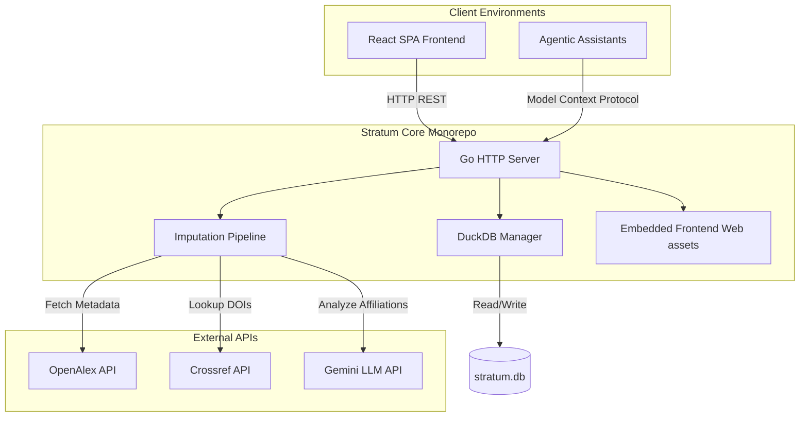

# Architecture Overview

Stratum consists of an integrated analytical database, an ingestion and enrichment pipeline, a REST API server, and a React frontend. This guide details how these components interact.

---

## 1. Backend Server & Engine

The backend is built in Go. Its responsibilities are split into several packages:

- **`main.go`**: Entry point that loads configuration, initializes the SQLite database (for application configurations and state), and starts the HTTP API server.
- **`db/`**: Handles interactions with the DuckDB analytical database (using the `duckdb-go` driver). Supports fast columnar SQL queries over normalized relational tables (`papers`, `authors`, `contributions`, `institutions`, `countries`) and direct queries over raw `.jsonl` files via DuckDB's native `read_json_auto()`.
- **`api/`**: Implements HTTP handlers for querying data, running pipelines, uploading files, managing projects, and importing JSONL data into DuckDB. It serves the compiled frontend assets using Go's `embed` package.
- **`openalex/`**: A wrapper for the OpenAlex API, supporting cursor pagination, concurrent fetching, and rate-limiting handles.
- **`impute/` & `openalex/commands/impute_country.py`**: Two-tier imputation engine:
  - **Pre-Ingestion JSONL Country Imputation (`openalex impute-country`)**: High-throughput 4-stage sequential heuristic cascade (existing code validation, authoritative ROR lookup, multi-tier gazetteer regex for countries, US states, and Indian states/UTs, and display name inspection) executed before database loading.
  - **In-Database Enrichment (`impute/`)**: Coordinates Crossref DOI metadata lookups, LLM prompts via Gemini API or local Ollama instances, and full-text PDF parsing over DuckDB tables.
- **`tfidf/` & `scripts/`**: Dual-stage keyword mining: fast in-Go TF-IDF term frequency calculation extracts a candidate pool (default: 20 terms), followed by dense semantic re-ranking using KeyBERT with the `allenai-specter` scientific embedding model via Python subprocess execution with virtualenv discovery.

---

## 2. Ingestion and Imputation Pipelines

Data enters the system via a sequence of pipelines:

1. **Ingestion Pipeline**: Queries OpenAlex based on boolean keywords and topic filters, downloading thousands of JSON works concurrently to raw JSONL files (`openalex download`).
2. **Pre-Ingestion Country Imputation**: High-performance, non-destructive 4-stage cascade (`openalex impute-country`) executed directly on `.jsonl` files before DuckDB ingestion:
   - **Stage 1 (Preserve Existing)**: Retains valid ISO-2/3 country codes in `institution.country_code` and `authorship.countries`.
   - **Stage 2 (ROR API Lookup)**: Authoritative lookup against `api.ror.org` for institutions having an ROR ID, using rate limiting and memoized caching.
   - **Stage 3 (Affiliation String Regex & Gazetteers)**: Word-boundary pattern matching against explicit country aliases (longest phrase first), Indian states and UTs (all 36), US states and territories, and formatted US state abbreviations.
   - **Stage 4 (Institution Display Name Inspection)**: Fallback token scanning of `institution.display_name` for national or regional markers.
   - **Dual Target Resolution**: Writes resolved codes to `institution.country_code` or `authorship.countries` (for authorships lacking institutions).
3. **Conversion & Import Pipeline**: Parses JSONL records line-by-line, normalizes paper metadata, author affiliations, institutions, and country mappings, and bulk loads them into DuckDB relational tables via `POST /api/db/import-jsonl` or full pipeline sync. DuckDB also supports direct SQL analytics over `.jsonl` files without prior conversion.
4. **Post-Ingestion Metadata Restoration**: Scans loaded DuckDB records for remaining missing metadata:
   - **Crossref**: Querying publisher metadata and ORCIDs by DOI.
   - **LLM**: Sending raw author affiliation strings to Gemini or Ollama to extract normalized institution names and country codes.
   - **Full-Text PDF Extraction**: Downloading open-access PDF streams and parsing first-page text objects via LLM.

---

## 3. Frontend Single Page Application (SPA)

The user interface is a single-page dashboard built with:
- **Vite & React (TanStack Router)**: Fast client routing, stateful reactive views, and quick builds.
- **Tailwind CSS & Lucide Icons**: Clean, premium monochrome interface with responsive multi-column layouts (including balanced 50/50 studio views for Keywords & Anchors, Search Analysis, and Imputation).
- **SQL Explorer & Query Studio**: In-browser analytical query console with live table row count badges, execution timers, CSV exports, and direct JSONL querying.
- **Embedded Deployment**: Production build assets (`dist/`) are embedded directly into the Go binary. When the Go server starts, it serves the React application on port `8080`.
